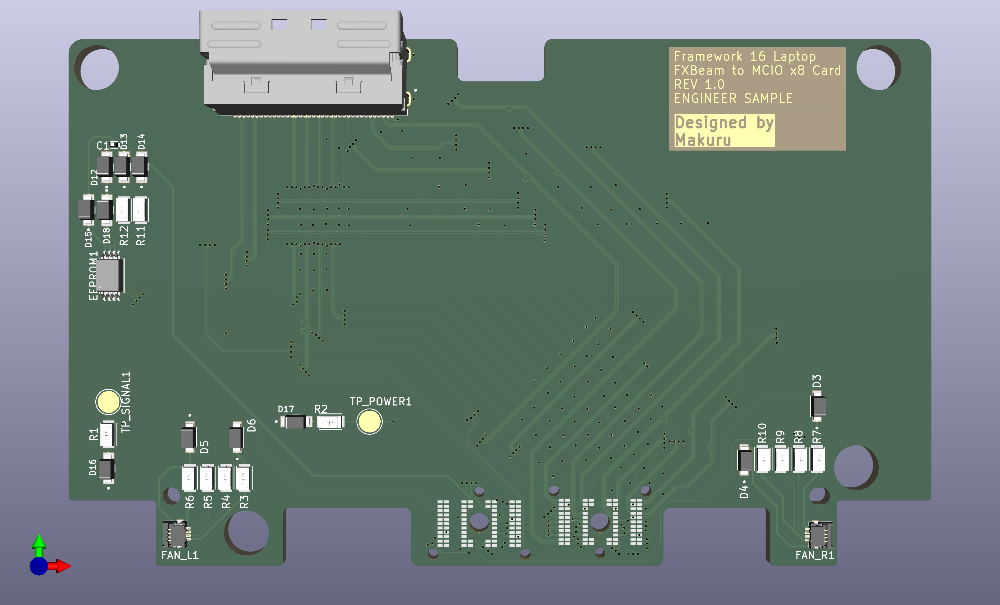

<!--
# Usecase
This is the source files needed to easily create an Framework 16 to MCIO expansion bay, so one can add a external GPU to the FW 16.
# PCB Render

# Schematics

# How to use
1. Order PCB by JLCPCB with the correct impedence matching. (pls create issue if confused or help needed)
2. Order ADT-link's MCIO to PCIe eGPU station with MCIO cable. (tested with F37C version)
3. Print repo's STD files with a 3D printer.

# License
My changes are licensed under: [https://cern-ohl.web.cern.ch/](CERN-OHL-S).

The plain PCB template is I believe the https://github.com/jyancat/ExpansionBay under CC BY 4.0.

This is a fork of the [https://github.com/Terrails/FW16-OCuLink](Terrails), work as of writting this, it is not licensed, IE under **UNLICENSED**.
--!>
# STILL IN DEV
